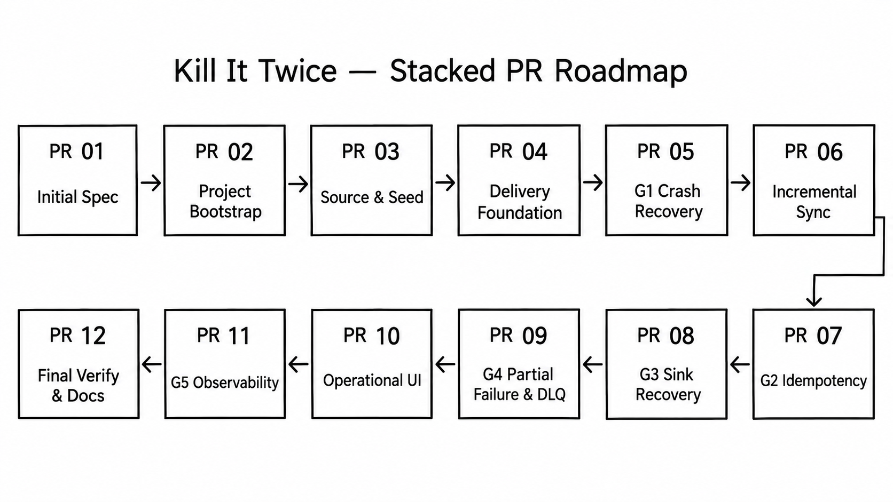

# Kill It Twice

ამ ეტაპზე პროექტი დაგეგმვის პროცესშია მანამ კოდის წერაზე გადავალ. რადგან პირდაპირი კომუნიკაცია არ მაქვს სჯობს თავიდანვე დავაფიქსირო თუ როგორ გავიგე დავალება, რა გადაწყვეტილებები მივიღე დასაწყისშივე და როგორ ვაპირებ მუშაობის გაგრძელებას. შესაძლებელია ზოგი ტექნიკური გადაწყვეტილება პროცესში შეიცვალოს და ასეთ ცვლილებებს და მათ მიზეზებს ცალკე აღვწერ.

## როგორ გავიაზრე დავალების არსი

უნდა ავაწყო მონაცემების სინქრონიზაციის სისტემა, რომელიც დატას ბაზიდან წაიკითხავს და elasticsearch-სა და RabbitMQ-ში გააგზავნის

1. Elasticsearch-ში სადაც ჩანაწერების მიმდინარე მდგომარეობა შეინახება და მოძებნადი იქნება
2. RabbitMQ-ში, საიდანაც მოვლენებს დამოუკიდებელი Consumer მიიღებს

Pipeline-ს ექნება მუშაობის ორი რეჟიმი:

- Backfill - სორსში უკვე არსებული მონაცემების პირველადი გადატანა
- Incremental sync - ბექფილის დაწყების შემდეგ, მონაცემების მუდმივი დამუშავება

ორივე რეჟიმმა პარალელურად უნდა იმუშავოს

დავალების მთავარი არსია მონაცემების უსაფრთხოდ გადატანა ისე, რომ პროცესი სწორად გაგრძელდეს მოულოდნელი გათიშვის, elasticsearch-ის ან RabbitMQ-ის შეფერხების, დუბლირებული ჩანაწერებისა და batch-ის ნაწილობრივი შეცდომის შემთხვევაშიც
და აუცილებელია ყველა ეს სცენარი ავტომატურად შემოწმდეს "make verify" კომანდით

## არჩეული ტექნოლოგიები

საწყის ეტაპზე ავირჩიე შემდეგი ტექნოლოგიები:

- BE - NestJS
- FE — Angular
- Source database — PostgreSQL
- Search index — Elasticsearch
- Event broker — RabbitMQ
- Run env — Docker Compose

Angular და TypeScript ჩემი ძირითადი სტეკია. დროის ეფექტურად გამოყენებისთვის ბექსაც ნესტით დავწერ(TS)

## მონაცემების მიწოდება

Pipeline გამოიყენებს at-least-once delivery მიდგომას. მონაცემები რომ არ დაიკარგოს თუმცა შესაძლოა განმეორებით გაიგზავნოს
თუმცა იმისთვის რომ თავიდან ავირიდო დუპლიკატები ელასტიკსერჩი გამოიყენებს უცვლელ ID da ვერსიას (ფლეგს) და rabbitmq cunsomer ამ ივენთს მეორედ აღარ დაამუშავებს
საბოლოო ჯამში გამოვა effectively-once

## სამუშაოს დაყოფა ტასკებად



პროექტს ცალკე ეტაპებად დავყოფ შემდეგი პრინციპით: ერთი branch, ერთი Pull Request და ერთი commit

პულ რექვესთები ერთმანეთზე თანმიმდევრულად იქნება მიბმული მაგალითად პირველი PR > main branch, მეორე PR > პირველი ბრენჩი, მესამე PR > მეორე ბრენჩი და ა.შ.

თით`ეული ბრენჩი მოიცავს ერთ კონკრეტულ ტექნიკურ ცვლილებას, შესაბამის სპეც და რიდმიში საჭირო განახლებებს. კომიტების ისტორიაში გამოჩნდება დეველოპმენტის ყველა ნაბიჯი და გადაწყვეტილებები

საწყისი PR-ების გეგმაა

1. საწყისი SPEC და repository-ის წესები
2. პროექტისა და Docker მომზადება
3. Source database და მონაცემების გენერაცია
4. მონაცემების Elasticsearch-სა და RabbitMQCHANT-ში გაგზავნა (საწყისი საფუძველი)
5. G1- Backfill-ის აღდგენა crash-ის შემდეგ
6. incremental sync-ის გაშვება ბექფილის პარალელურად
7. G2 — დუბლიკატების დამუშავება
8. G3 — მიმღები სისტემის ჩავარდნა და ავტომატური აღდგენა
9. G4 — ნაწილობრივ ჩავარდნილი batch და DLQ
10. მართვის API და Angular UI
11. G5 — მეტრიკები, ლოგები და სისტემის მდგომარეობა
12. საბოლოო make verify

ეს სია საწყისი გეგმაა. თუ მუშაობისას გამოჩნდება, რომ რომელიმე ნაწილი სხვაგვარად უნდა გაიყოს, ცვლილებას და მის მიზეზს დავაფიქსირებ.

## საბოლოო ბრძანებები

დასრულებულ პროექტში მთელი სისტემა უნდა გაეშვას შემდეგი ბრძანებით:

```bash
docker compose up --build
```

საწყისი მონაცემების შექმნა:

```bash
make seed
```

ხუთივე Gate-ის ავტომატური შემოწმება:

```bash
make verify
```

## AI გამოყენება

აგენტს კოდის დასაწერად არ ვიყენებ, მაგრამ ვიყენებ ჩატს ყველა კითხვის დასასმელად და სწორი პასუხების მიღება/გარჩევისთვის.

შეიძლება ამ მიდგომით მეტი დრო მეხარჯება, მაგრამ მინდა ზუსად ვიცოდე პროექტში სად რა მიწერა და რა მიზეზით.

ამ მიდგომით მომავალში შემიმცირდება დრო ბაგების საპოვნელად თუ კოდის რეფაქტორინგისთვის

## რას არ ვწერ წინასწარ

- სქემას და მონაცემების მოძრაობის გზას
- რა ტექნიკური გადაწყვეტილებები მივიღე და რატო
- make verify ბრძანების ბოლო შედეგებს
- რამდენად სწრაფად მუშაობს სისტემა ან რატომ არის ნელი
- რომელი ფუნქციები არ გავაკეთე და რატომ
- რა შეიცვალა საწყის გეგმასთან შედარებით ან რატომ ვერ ვასწრებ რომელიმე გეითის დახურვას
- სად არ მომეწონა ჩატის შემოთავაზება და როგორ შევცვალე
