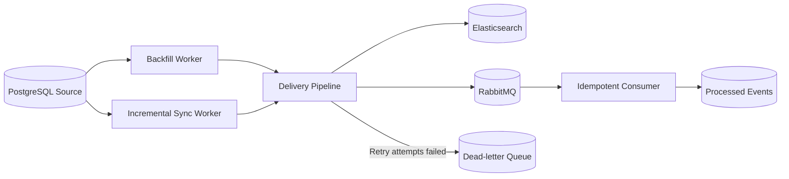

# Kill It Twice

ეს არის პროექტის საბოლოო ვერსია. PostgreSQL-ის customer მონაცემები სინქრონიზდება Elasticsearch-სა და RabbitMQ-ში და დამუშავებულია crash recovery, idempotency, retry, DLQ და observability.

დროის სიმცირის გამო ვეღარ მოვასწარი დარჩენილი code smell-ების გასწორება, დამატებითი refactoring და სრულყოფილი test coverage. პროექტის ძირითადი ფუნქციონალი და ხუთივე verification gate მუშაობს.

## მოთხოვნები

პროექტის გასაშვებად საჭიროა:

- Git;
- Docker Desktop ჩართული Docker Compose v2-ით;
- Node.js 24;
- npm;
- Bash;
- curl.

GNU Make აუცილებელი არ არის. თუ Make უკვე გაქვთ დაყენებული, შეგიძლიათ გამოიყენოთ `make install`, `make setup`, `make start` და `make verify`. წინააღმდეგ შემთხვევაში იგივე მოქმედებები გაუშვით შესაბამისი `bash ./scripts/...` ბრძანებებით.

პროექტზე macOS გარემოში ვმუშაობდი და Windows-ზე მისი სრულად შემოწმების საშუალება არ მქონდა. ამიტომ README-ში აღწერილია ორივე ვარიანტი: Make ბრძანებები macOS/Linux გარემოსთვის და პირდაპირი Bash scripts Windows Git Bash-ისთვის.

## სწრაფი გაშვება

| ნაბიჯი          | Make                    | Bash / Windows Git Bash                   |
| --------------- | ----------------------- | ----------------------------------------- |
| 1. Dependencies | `make install`          | `bash ./scripts/install.sh`               |
| 2. Setup        | `make setup COUNT=1000` | `SEED_COUNT=1000 bash ./scripts/setup.sh` |
| 3. Start        | `make start`            | `bash ./scripts/start.sh`                 |
| 4. Verification | `make verify`           | `bash ./scripts/verify.sh`                |

Bash ბრძანებები მუშაობს macOS-ზე, Linux-ზე და Windows Git Bash-ში.

## ინდივიდუალური Gate-ების გაშვება

სრული verification-ის ნაცვლად შესაძლებელია თითოეული Gate-ის ცალ-ცალკე გაშვებაც.

| Gate                              | Make             | Bash / Windows Git Bash       |
| --------------------------------- | ---------------- | ----------------------------- |
| G1 — Backfill crash recovery      | `make verify-g1` | `bash ./scripts/verify-g1.sh` |
| G2 — Duplicate handling           | `make verify-g2` | `bash ./scripts/verify-g2.sh` |
| G3 — Destination recovery         | `make verify-g3` | `bash ./scripts/verify-g3.sh` |
| G4 — Partial batch failure და DLQ | `make verify-g4` | `bash ./scripts/verify-g4.sh` |
| G5 — Observability                | `make verify-g5` | `bash ./scripts/verify-g5.sh` |

ყველა ბრძანება repository-ის root დირექტორიიდან უნდა გაეშვას.

---

Setup ავტომატურად:

- შექმნის `.env` ფაილს;
- ააწყობს Docker image-ებს;
- გაუშვებს PostgreSQL-ს, Elasticsearch-სა და RabbitMQ-ს;
- შეასრულებს database migrations-ს;
- შექმნის 1,000 customer-ს;
- მოამზადებს Elasticsearch index-სა და RabbitMQ topology-ს;
- გაუშვებს საწყის Backfill-ს.

სხვა რაოდენობის მონაცემისთვის შეცვალეთ `1000`, მაგალითად:

```bash
SEED_COUNT=10000 bash ./scripts/setup.sh
```

> Setup development მონაცემებს თავიდან ამზადებს.

### 3. აპლიკაციის გაშვება

Make:

```bash
make start
```

Bash:

```bash
bash ./scripts/start.sh
```

აპლიკაციის მისამართები:

- Frontend: [http://localhost:8080](http://localhost:8080)
- Backend: [http://localhost:3000](http://localhost:3000)
- Health: [http://localhost:3000/health](http://localhost:3000/health)
- System status: [http://localhost:3000/status](http://localhost:3000/status)
- RabbitMQ Management: [http://localhost:15672](http://localhost:15672)

## Verification

სრული verification:

Make:

```bash
make verify
```

Bash / Windows Git Bash:

```bash
bash ./scripts/verify.sh
```

Verification რამდენიმე წუთს მოითხოვს, სატესტო გარემოს თავიდან ამზადებს და ხუთივე reliability gate-ს ამოწმებს:

- G1 — Backfill crash recovery;
- G2 — duplicate event handling;
- G3 — destination outage recovery;
- G4 — partial batch failure და DLQ;
- G5 — observability.

წარმატებული შედეგი:

```text
Verification report
============================================================
G1 resume after kill ............ PASS
G2 no duplicates ................ PASS
G3 sink outage .................. PASS
G4 partial batch failure ........ PASS
G5 observability ................ PASS
```

## ინდივიდუალური Gate-ები

### G1 — Backfill crash recovery

```bash
bash ./scripts/verify-g1.sh
```

### G2 — Duplicate handling

```bash
bash ./scripts/verify-g2.sh
```

### G3 — Destination recovery

```bash
bash ./scripts/verify-g3.sh
```

### G4 — Partial batch failure და DLQ

```bash
bash ./scripts/verify-g4.sh
```

### G5 — Observability

```bash
bash ./scripts/verify-g5.sh
```

Make-ის გამოყენების შემთხვევაში იგივე Gate-ები ასე ეშვება:

```bash
make verify-g1
make verify-g2
make verify-g3
make verify-g4
make verify-g5
```

## პროექტის ფუნქციონალი

პროექტი მოიცავს:

- crash-resumable Backfill processing-ს;
- უწყვეტ Incremental Sync-ს;
- Elasticsearch-სა და RabbitMQ-ში event delivery-ს;
- retry-სა და destination recovery-ს;
- idempotent RabbitMQ consumer-ს;
- partial batch failure isolation-ს;
- Dead-letter queue-სა და replay-ს;
- metrics, health და system status endpoint-ებს;
- Angular dashboard-ს customer-ების, worker-ებისა და failure simulation-ის სამართავად.

## მონაცემების დამუშავების Flow



- **Backfill** ამუშავებს საწყის customer snapshot-ს.
- **Incremental Sync** ამუშავებს ახალ ცვლილებებს.
- ორივე worker იყენებს ერთსა და იმავე delivery pipeline-ს.
- მონაცემები იგზავნება Elasticsearch-სა და RabbitMQ-ში.
- წარუმატებელი event-ები retry-ის შემდეგ გადადის DLQ-ში.
- RabbitMQ Consumer დუბლირებულ event-ებს idempotently ამუშავებს.

## გაჩერება

Make:

```bash
make stop
```

Make-ის გარეშე:

```bash
docker compose down
```
